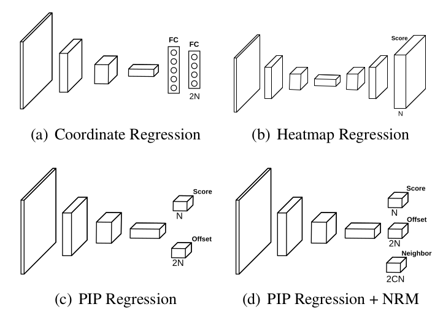

# Pixel-in-Pixel Net: Towards Efficient Facial Landmark Detection in the Wild
## Introduction
This is the code of paper [Pixel-in-Pixel Net: Towards Efficient Facial Landmark Detection in the Wild](https://arxiv.org/abs/2003.03771). We propose a novel facial landmark detector that is **fast**, **accurate**, and **robust**.
<!--  -->


## Installation
1. Install PyTorch >= v1.1.0
2. Clone this repository.
```Shell
git clone https://github.com/jhb86253817/PIPNet.git
```
3. Install the dependencies in requirements.txt
```Shell
pip install -r requirements.txt
```

## Training

### Supervised Learning
Datasets: [300W](https://ibug.doc.ic.ac.uk/resources/facial-point-annotations/), [COFW](http://www.vision.caltech.edu/xpburgos/ICCV13/), [WFLW](https://wywu.github.io/projects/LAB/WFLW.html), [AFLW](https://www.tugraz.at/institute/icg/research/team-bischof/lrs/downloads/aflw/)

1. Download the datasets from official sources, then put them under folder `data`. The folder structure should look like this:
````
PIPNet
-- lib
-- experiments
-- data
   |-- data_300W
       |-- afw
       |-- helen
       |-- ibug
       |-- lfpw
   |-- COFW
       |-- COFW_train_color.mat
       |-- COFW_test_color.mat
   |-- WFLW
       |-- WFLW_images
       |-- WFLW_annotations
   |-- AFLW
       |-- flickr
       |-- AFLWinfo_release.mat
````
2. Go to folder `lib`, preprocess a dataset by running ```python preprocess.py DATA_NAME```. For example, to process 300W:
```
python preprocess.py data_300W
```
3. Back to folder `PIPNet`, edit `run_train.sh` to change the config file you want. Then, train the model by running:
```
sh run_train.sh
```
### Unsupervised Domain Adaptation

## Evaluation
1. Edit `run_test.sh` to change the config file you want. Then, test the model by running:
```
sh run_test.sh
```

## Demo
1. We use a modified version of [FaceBoxes](https://github.com/zisianw/FaceBoxes.PyTorch) as the face detector, so go to folder `FaceBoxesV2/utils`, run `sh make.sh` to build for NMS.
2. For PIPNets, you can download our trained models from here, and put them under folder `snapshots/DATA_NAME/EXPERIMENT_NAME/`. 
3. Back to folder `PIPNet`, edit `run_demo.sh` to choose the config file and input source you want, then run `sh run_demo.sh`. We support image, video, and camera as the input. Some sample predictions can be seen as follows.
* PIPNet trained on WFLW, with an image `images/1.jpg` as the input:

* PIPNet trained on WFLW, with an video `videos/002.avi` as the input:

